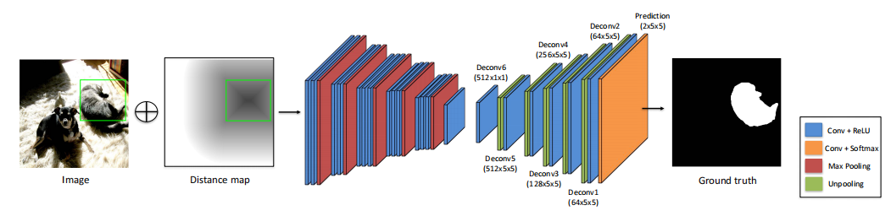
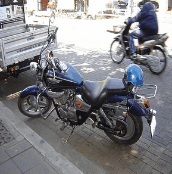

# Deep GrabCut (DeepGC)



This is a PyTorch implementation of [Deep GrabCut](https://arxiv.org/pdf/1707.00243), for object segmentation. We use DeepLab-v2 instead of DeconvNet in this repository.

### Installation
The code was tested with Python 3.5. To use this code, please do:

0. Clone the repo:
    ```Shell
    git clone https://github.com/jfzhang95/DeepGrabCut-PyTorch
    cd DeepGrabCut-PyTorch
    ```
 
1. Install dependencies:
    ```Shell
    pip install pytorch torchvision -c pytorch
    pip install matplotlib opencv pillow
    ```
  
2. You can download pretrained model from [GoogleDrive](https://drive.google.com/open?id=1N8bICHnFit6lLGvGwVu6bnDttyTk6wGH), and then put the model into models/

3. To try the demo of Deep GrabCut, please run:
    ```Shell
    python demo.py
    ```
If installed correctly, the result should look like this:
<p align="center"></p>
Note that the provided model was trained only on VOC 2012 dataset. You will get better results if you train model on both VOC and SBD dataset.


To train Deep GrabCut on VOC (or VOC + SBD), please follow these additional steps:

4. Download the pre-trained PSPNet model for semantic segmentation, taken from this [repository](https://github.com/isht7/pytorch-deeplab-resnet).
    ```Shell
    cd models/
    chmod +x download_pretrained_psp_model.sh
    ./download_pretrained_psp_model.sh
    cd ..
    ```
5. Set the paths in ```mypath.py```, so that they point to the location of VOC/SBD dataset.

6. Run ```python train.py``` to train Deep Grabcut.

7. If you want to train model on COCO dataset, you should first config COCO dataset path in mypath.py, and then run
```python train_coco.py``` to train model.
